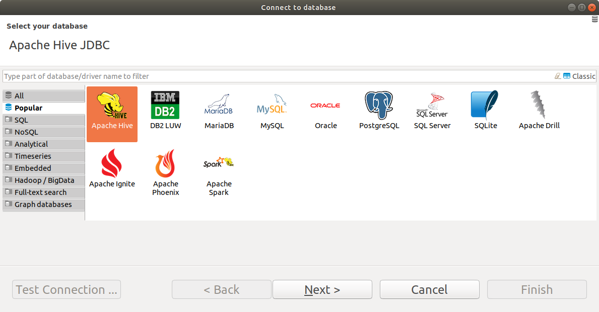
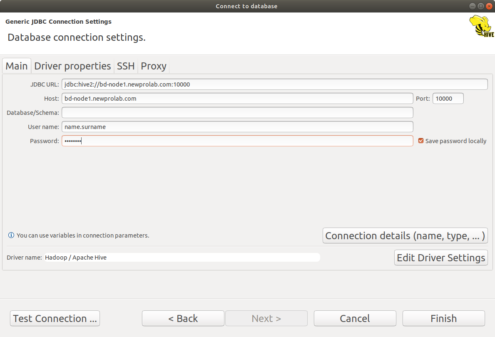
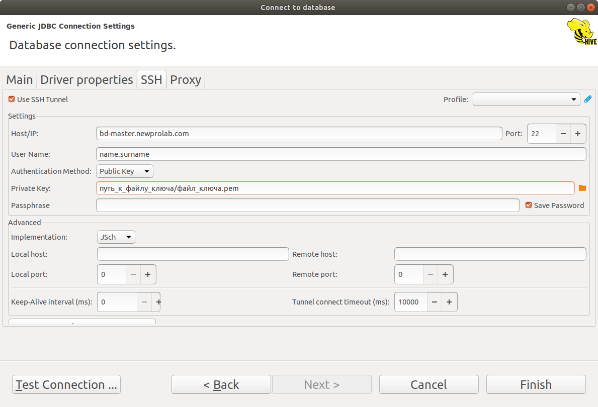

# DBeaver + Apache Hive

DBeaver - это бесплатная утилита для подключения к различным базам данных. Работает с Oracle, MySQL, MS SQL, Postgres, Apache Hive и многими другими.   

В этом документе описана последовательность действий для подключения к Apache Hive.

Если у вас есть какой-либо другой клиент для подключения к БД, вы можете использовать его.  
Использовать именно DBeaver необязательно.


## Установка 

Заходим на сайт DBeaver: https://dbeaver.io/download/  
Выбираем дистрибутив, подходящий для вашей операционной системы, и устанавливаем.

## Настройка подключения к Hive

Открываем DBeaver.

Заходим в меню -> Database -> "New Databse Connection".  
Можно кнопочкой на панели (вилка с плюсиком).

Откроется новое окно "Connect to databse".


Выбираем "Apache Hive" и жмём "Next"

Откроется следующее окно.

### Вкладка "Main"

На первой вкладке задаём параметры подключения

| Параметр | Значение |
--- | ---
|JDBC URL| Не заполняем, будет заполнен автоматически|
|Host|bd-node1.newprolab.com|
|Port|10000|
|Database/Schema|Если подключаетесь к базе **впервые** - нужно оставить пустым. <br> Если вы уже создали свою схему - укажите имя схемы в формате ```name_surname```|
|User name|Укажите имя пользователя от личного кабинета в формате ```name.surname```|
|Password|Пароль от личного кабинета|
Ставим галочку "Save password locally"

Кнопку Test Connection пока не нажимаем.



### Вкладка "Driver Properties"

Переключаемся на вторую вкладку "Driver Properties".  
Здесь вам предложат скачать драйвер для подключения к Apache Hive, если его ещё нет в системе. Обычно всё проходит без ошибок. Везде соглашаемся.

### Вкладка "SSH"
Переключаемся на третью вкладку "SSH".    
Ставим галочку "Use SSH Tunnel".

Заполняем:

| Параметр | Значение |
--- | ---
|Host/IP | bd-master.newprolab.com |
|Port|22|
|User Name|Укажите имя пользователя от личного кабинета в формате ```name.surname```|
|Authentication method|Выберите "Public key"|
|Private key|Укажите путь к файлу серификата из личного кабинета.Обычно он располагается в папке ```~/.ssh/...```|



После заполнения всех полей нажмите кнопку "Test tunnel configuration".  
Должно появиться сообщение, что всё ОК.  
Значит подключение к серверу через SSH настроено правильно.

### Проверка соединения с БД
Переключаемся на вкладку Main


Жмём кнопку "Test Connection".  
Если всё введено верно, то будет установлено соединение с Apache Hive через сервер, указанный на вкладке SSH.  

## Создание своей схемы (если подключились впервые)

Если вы зашли на сервер впервые, то у вас, скорее всего, нет личной схемы данных.

Её нужно создать. 

Личная схема данных позволит вам не пересекаться табличками с коллегами. 

Для этого откройте новое окно для запуска SQL с помощью  ```Ctrl+]```  
или через меню -> SQL Editor -> New SQL Editor

В появившемся окне введите следующий скрипт (укажите имя схемы в формате ```name_surname```)  

```
create database name_surname;
use name_surname;
``` 
и нажмите ```Ctrl+Enter```

Если всё сделали правильно, сервер Hive создал для вас персональную схему данных.  
Теперь вы сможете работать в ней, и вам никто не будет мешать.  

Чтобы настроить автоматическое подключение именно к своей схеме, а не к default, нужно:  
  * найти в Database Navigator подключение, которое вы только что настроили  
  * открыть его свойства через ```F4``` или через ```Right-Click```-> Edit connection  
  * на вкладке "Main" в поле Database/Schema укажите название схемы, которое вы указывали в скрипте
  * сохраните изменения
  * Отключитесь от БД (выберите соединение -> ```Right-Click``` -> Disconnect или через "красную вилку" на панели)
  * Подключитесь к БД заново
  
После повторного подключения ваша схема данных будет жирненькой. Это значит, что вы вошли именно в неё.

Дальше можно делать ваше задание.

## Hints
Открывать новое окно с SQL кодом удобно через ```Ctrl+]```.  
Выполнить текущий или выделенный фрагмент кода удобно через ```Ctrl+Enter```.  
Если выделить в тексте фрагмент SQL-кода мышкой - DBeaver попытается выполнить именно его. Это удобно, когда есть "матрёшка" из select'ов, и нужно выполнить только некоторые из них.  
Внутри SQL кода не должно быть пустых строк. Пустая строка - это разделитель блоков кода.  
При выходе из DBeaver вкладки с кодом можно сохранять. Но код всё же лучше централизованно хранить в репозитории.  
 
