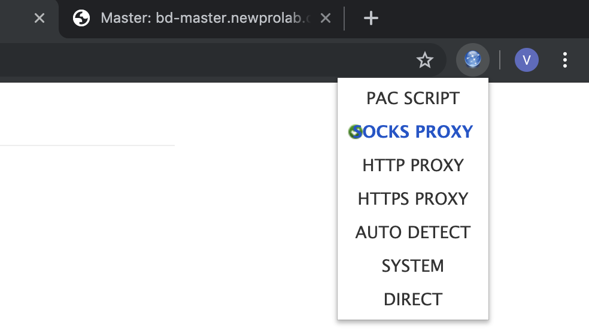

# Прокси

## TL;DR Intro

Простой сокс5 прокси сервер был установлен на нашем облаке, чтобы использовать его для доступа к AWS в случае проблем с локальным провайдером (некоторые подсети амазона все еще заблокированы), а также с точки зрения безопасности кластера извне.

Прокси работает с браузерами только через туннель. Это, в общем-то, фундаментальное ограничение, так как через туннель происходит авторизация, а браузеры не авторизуют вход на прокси сервер.

Итак, как это выглядит в целом. Сначала вы создаете ssh туннель на машину, на которой запущен прокси сервер. Затем вы конфигурируете прокси-соединение в вашем браузере, причем в качестве сервера выступает localhost - это "начало" туннеля, который вы создали через ssh.

Таким образом, каждый раз, когда вы захотите воспользоваться прокси соединением, вам придется создать туннель. Это не очень удобно, так как, например, если ваш лаптоп заснет, то туннель придется поднимать заново. Поэтому мы рекомендуем использовать отдельный браузер с настройками прокси для доступа к Амазону, а в вашем основном браузере использовать "обычный" интернет от локального провайдера.


## Как настроить туннель

### Linux/MacOs

Для упрощения создания туннеля следует добавить следующую секцию в ваш .ssh/config

```
Host nplp
HostName bd-node1.newprolab.com
Port 22
User name.surname
DynamicForward 1080
IdentityFile ~/.ssh/newprolab.pem
```

и в конец вашего ssh конфига

```
Host *
ServerAliveInterval 30
LogLevel INFO
UserKnownHostsFile ~/.ssh/known_hosts
```

Тогда вы сможете запустить тунель как: `ssh -N nplp`

Или если не добавлять ничего в конфиг, то можно подключиться одной командой
```
ssh -i <полный путь к приватному ключу> name.surname@bd-node1.newprolab.com -D localhost:1080 -N
```

### Windows

Настройте новую сессию Putty на `name.surname@bd-node1.newprolab.com`, port 22.

Будьте внимательны и настройте оцпии ssh:

настраиваем туннель:


должно выглядеть вот так:


настраиваем, чтоб не выходило из терминала:


Не забудьте сохранить сессию!

Открываем, вводим пароль (пароль от личного кабинета), при успешном логине ничего не происходит, промпта нет.

### Настройка браузера

Так как неразумно использовать прокси для всего вашего трафика все время, то можно взять для этого дела неиспользуемый браузер и выделить его для "туннельного" доступа. Например, если пользуетесь Firefox в качестве основного браузера, то можно сконфигурировать Chrome для работы с прокси.


### Установка в хроме

Хром на Линукс и MAC OS почему-то не поддерживает настройку прокси через стандартные Settings, поэтому два пути ниже. А под Windows настройка прокси системная, смотрите описание настройки Internet Explorer. (Таким образом, вы не можете использовать Chrome и Internet Explorer для разных целей - они либо вместе без прокси, либо вместе с прокси).

### Хром – вариант 1

Установить в аддон [Proxy Helper](https://chrome.google.com/webstore/detail/proxy-helper/mnloefcpaepkpmhaoipjkpikbnkmbnic), настроить прокси используя socks5, как в картинке ниже:





### Хром – вариант 2

```
chromium-browser --proxy-server=socks5://localhost:1080
```

### Установка в Firefox

Preferences -> General -> Network Proxy -> Settings ...


### Internet Explorer

Настройки Браузера -> Соединения


### Проверка proxy

Зайдите на сайт [ifconfig.io](https://ifconfig.io) и проверьте, что ваш адрес начинается с `85.*`
